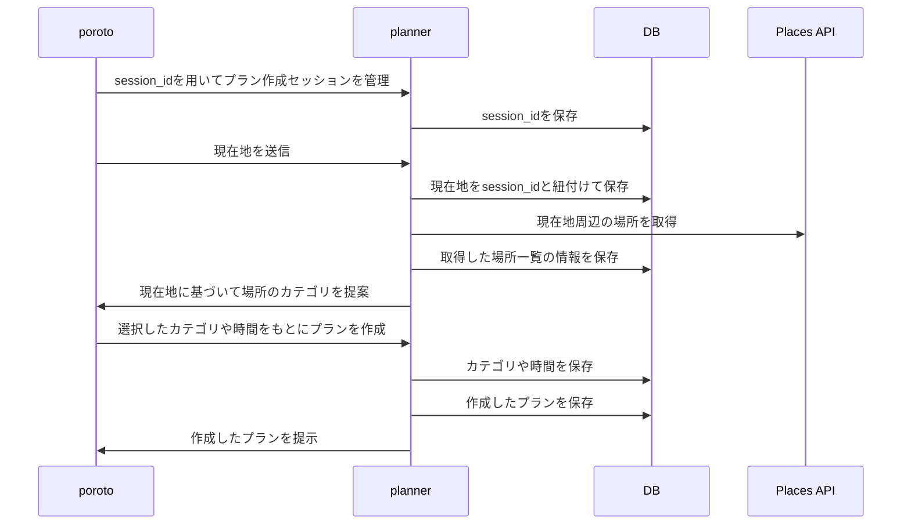
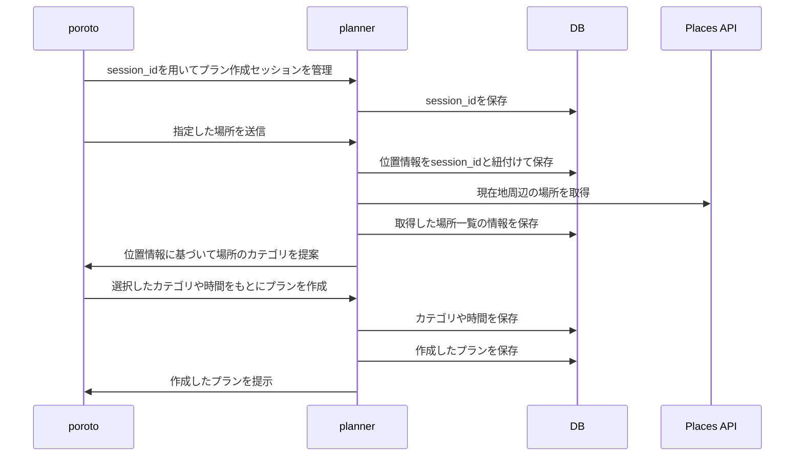

# Create Plan

### 現在地からプランを作成

### 場所を指定してプランを作成

## 例外対応
### `/plans/interest`でリロードされる
| 発生する問題                       | 対応方法         |
|------------------------------|--------------|
| ユーザーが指定した位置情報をクライアント側で保持できない | `session_id`をもとに情報を復元 |
| 同じ位置情報に基づいて重複して周辺の場所を検索してしまう | 検索結果をキャッシュする |

