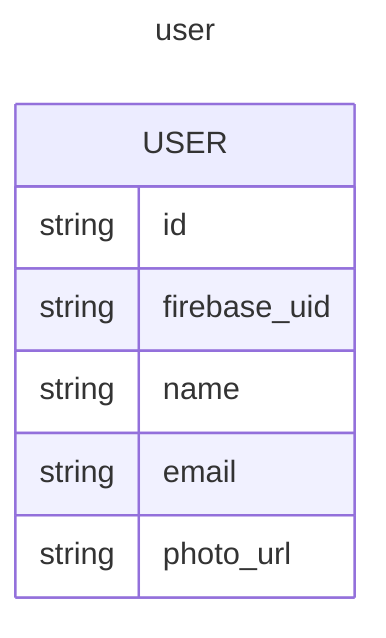
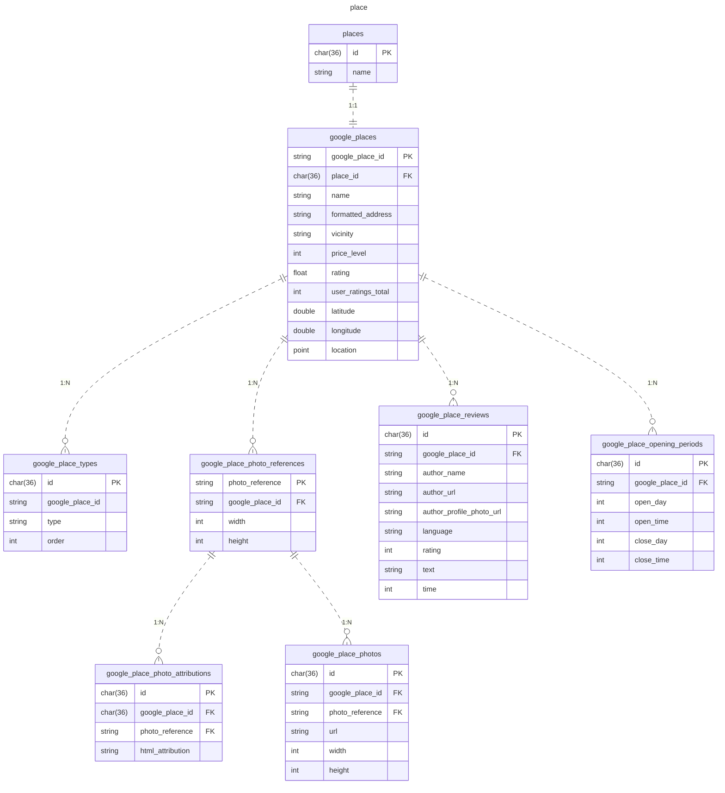

### User

```mermaid
---
title: user
---
erDiagram
    USER {
        string id
        string firebase_uid
        string name
        string email
        string photo_url
    }
```

### Place

```mermaid
---
title: place
---
erDiagram
    places {
        char(36) id PK
        string name
    }

    google_places {
        string google_place_id PK
        char(36) place_id FK
        string name
        string formatted_address
        string vicinity
        int price_level
        float rating
        int user_ratings_total
        double latitude
        double longitude
        point location
    }

    google_place_types {
        char(36) id PK
        string google_place_id
        string type
        int order
    }

    google_place_photo_references {
        string photo_reference PK
        string google_place_id FK
        int width
        int height
    }

    google_place_photos {
        char(36) id PK
        string google_place_id FK
        string photo_reference FK
        string url
        int width
        int height
    }

    google_place_photo_attributions {
        char(36) id PK
        char(36) google_place_id FK
        string photo_reference FK
        string html_attribution
    }

    google_place_reviews {
        char(36) id PK
        string google_place_id FK
        string author_name
        string author_url
        string author_profile_photo_url
        string language
        int rating
        string text
        int time
    }

    google_place_opening_periods {
        char(36) id PK
        string google_place_id FK
        int open_day
        int open_time
        int close_day
        int close_time
    }

    places ||..|| google_places: "1:1"
    google_places ||..o{ google_place_types: "1:N"
    google_places ||..o{ google_place_photo_references: "1:N"
    google_places ||..o{ google_place_opening_periods: "1:N"
    google_place_photo_references ||..o{ google_place_photo_attributions: "1:N"
    google_place_photo_references ||..o{ google_place_photos: "1:N"
    google_places ||..o{ google_place_reviews: "1:N"
```

- types
    - 並び替えが発生しないため、単純な`order`カラムで順番を管理