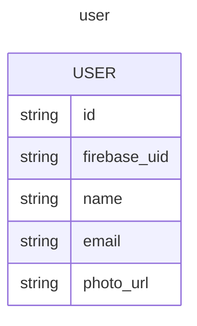
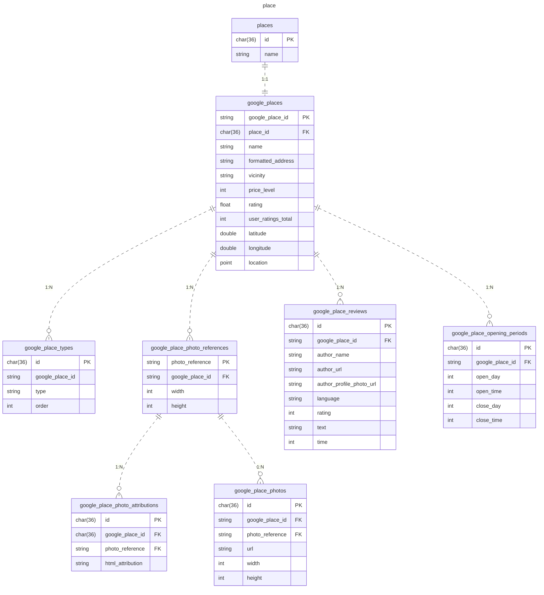
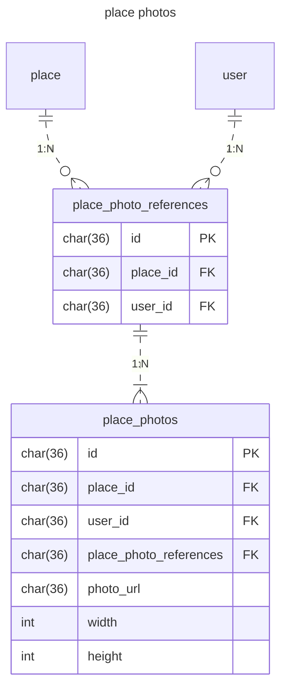
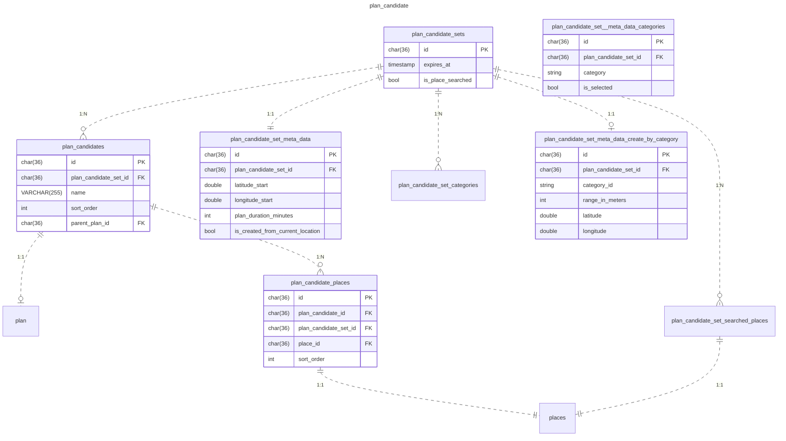
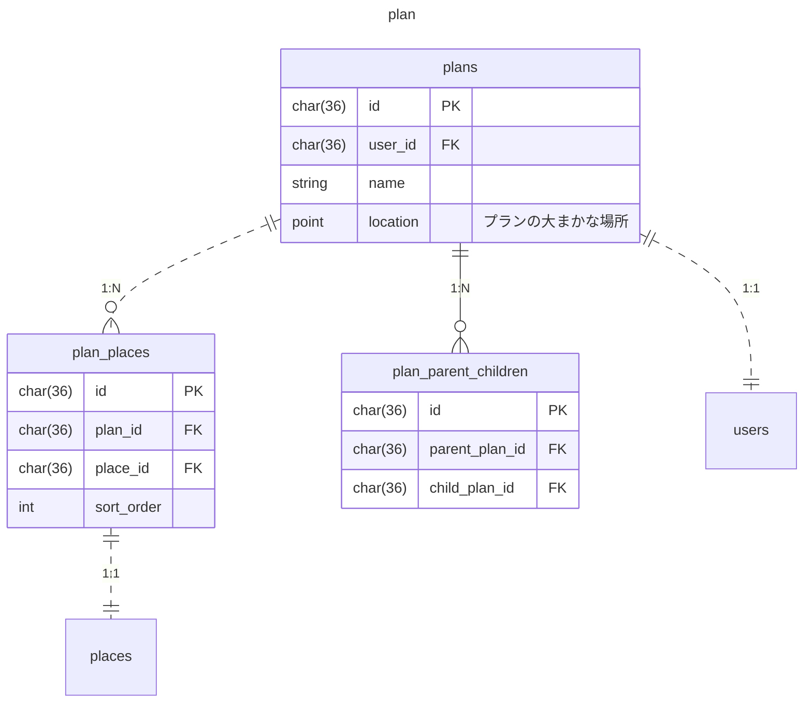
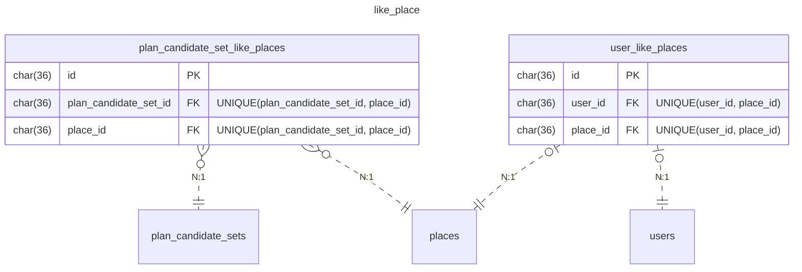
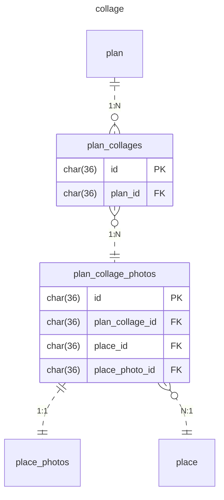
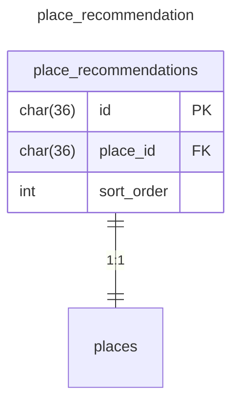

### User

### Place

- types
    - 並び替えが発生しないため、単純な`order`カラムで順番を管理

### Place Photos

### Plan Candidate
- 複数回検索が行われることを避けるため、`is_place_searched` で検索済みかどうかを管理

| テーブル                                            | 用途                  |
|-------------------------------------------------|---------------------|
| plan_candidate_sets                             | 作成されたプラン候補一覧を集約     |
| plan_candidate_set_meta_data                    | プラン作成時の情報           |
| plan_candidate_set_meta_data_create_by_category | プラン作成時に選択・却下したカテゴリ  |
| plan_candidate_set_meta_data_from_categories    | カテゴリからプランを作成したときの情報 |
| plan_candidates                                 | プラン候補               |
| plan_candidate_places                           | プラン候補に含まれる場所        |

### Plan

### Like Place

### Collage
- プランに対して作成されるコラージュ
- 一つの場所に対して複数の画像を登録することができる柔軟性を持たせるために制約はつけない
- プラン内の場所を削除したあとで、再度、同じ場所を追加したときに同じ画像が表示できるようにするため、`plan_places`との紐づけは行わない
- コラージュ画像の目的はユーザの画像アップロードを促すことであるため、`google_place_photos`との紐づけは行わない
- TODO：異なるコラージュレイアウトに対応できるように、typeプロパティをつける

### Place Recommendation
- 重複した場所がおすすめに提示されないように、`place_id` に UNIQUE 制約を付与する
