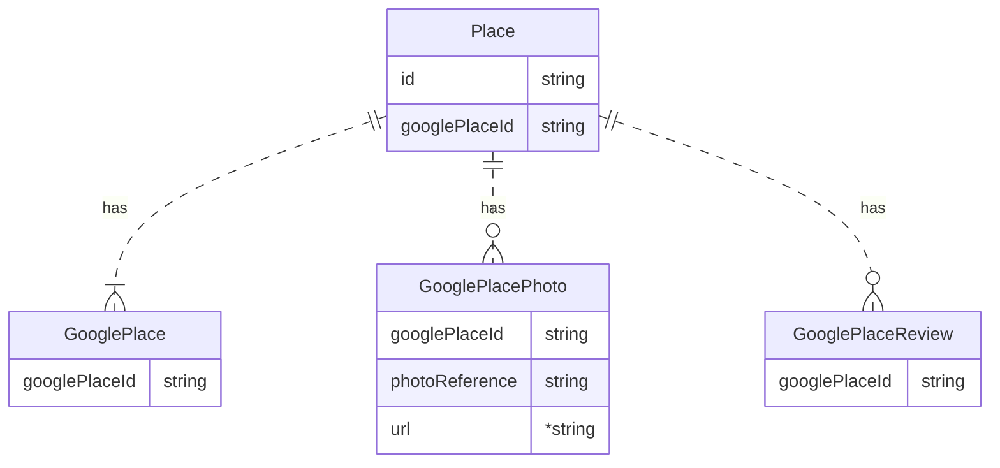
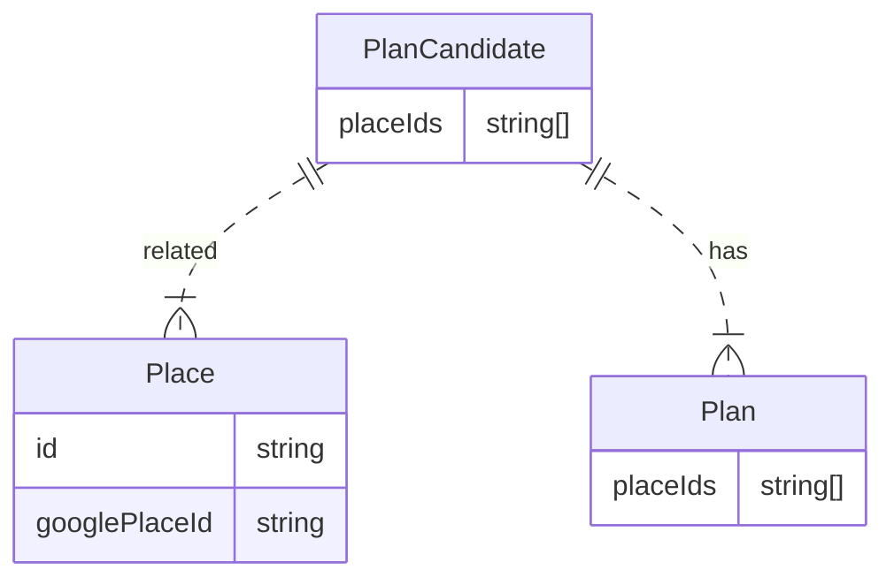

# Firestore Schema

## Place

## PlanCandidate

PlanCandidateはプランの情報と、プランに含まれる場所の参照を持つ

### Google Places APIで取得したデータ

`Google Places API`
から取得された場所のデータは`Places`, `GooglePlace`、`GooglePlacePhotos`、`GooglePlaceReviews`に保存される。  