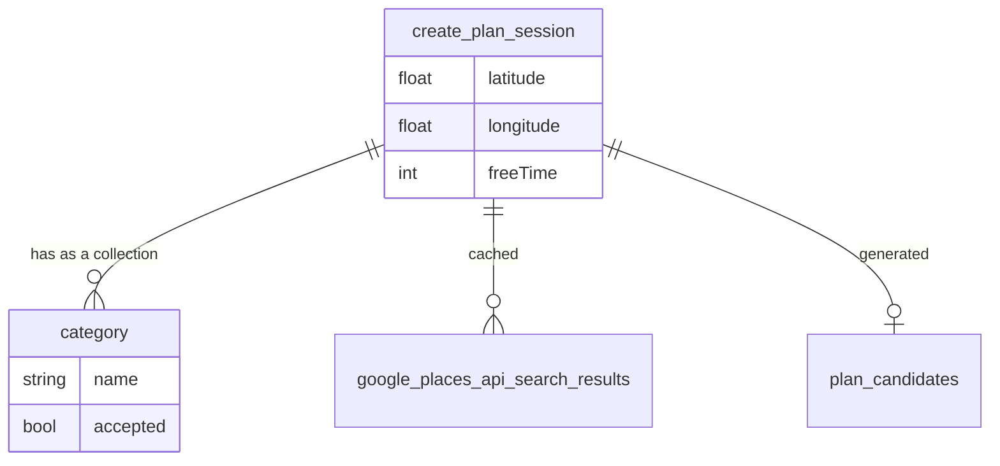

# Create Plan Session

```mermaid
erDiagram
    create_plan_session {
        float latitude
        float longitude
        int freeTime
    }

    category {
        string name
        bool accepted
    }

    create_plan_session ||--o{ category: "has as a collection"
    create_plan_session ||--o{ google_places_api_search_results: "cached"
    create_plan_session ||--o| plan_candidates: generated
```