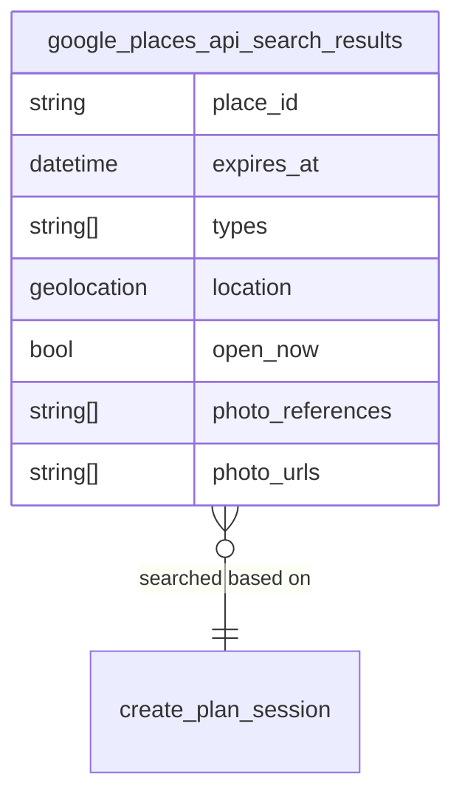

# Google Places API Search Results

### 目的
- プラン作成時に検索結果を再利用できるようにするため

### ER Diagram

```mermaid
erDiagram
    google_places_api_search_results {
        string place_id
        datetime expires_at
        string[] types
        geolocation location
        bool open_now
        string[] photo_references
        string[] photo_urls
    }
    
    google_places_api_search_results }o--|| create_plan_session: "searched based on"
```