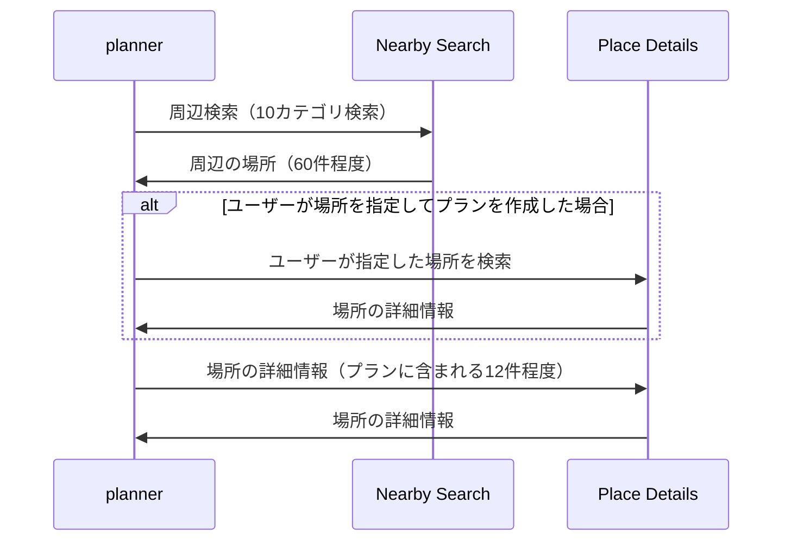

# Google Places API

### 料金体系

https://developers.google.com/maps/documentation/places/web-service/usage-and-billing?hl=ja

- [Places APIはリクエストに含まれるフィールド内で最上位のSKUに基づいて課金される](https://developers.google.com/maps/documentation/places/web-service/usage-and-billing?hl=ja)

### Place Detail APIの呼び出し方

- プラン作成時には複数回、Place Detailによる情報が必要な場面がある（開店時刻、写真、レビュー等）
- これらのリクエストを別々に行ってしまうと、`SKU料金*リクエスト回数`の料金が発生してしまう
- したがって、planner では、Place Detailによる情報を一度に取得するようにしている

### リクエストのフロー

