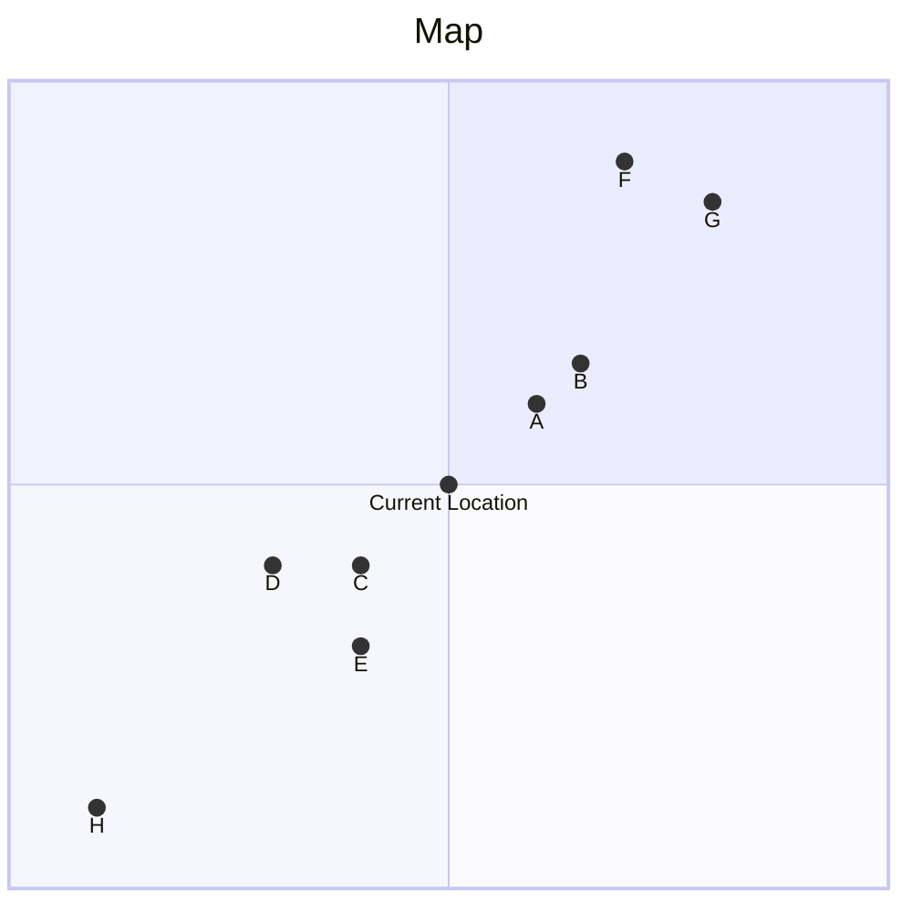

# プラン作成方針

## このドキュメントの目的
- プラン作成アルゴリズムの背景を共有するため

## プラン作成に用いる場所の例


| 場所 | Rating |
|----|--------|
| A  | 4      |
| B  | 5      |
| C  | 3      |
| D  | 4      |
| E  | 4      |
| F  | 5      |
| G  | 4      |
| H  | 2      |

## プランの起点となる場所の選択
- 近くでプランが作られるように、現在地に近い場所からプランを作成
- より良い場所が含まれるように、徐々に範囲を広げてプランを作成する

1. 現在地に近い場所からレビュー等に基づいて候補となる場所を選択
    ```
    A, B, C, D, E
    ```
2. 選択した場所をベースにプランを作成する
    ```
    A -> B
    D -> C -> E
    ```
3. もっとも多くの場所を含むプランを選択
    ```
    D -> C -> E 
    ```
   
**範囲を広げて、2つ目以降のプランを作成**
1. より広い範囲で起点となる場所を選択  
    このときに、すでにプランに含まれている場所は選択されないようにする
    ```
    A, F, G
    ```
2. 選択した場所をベースにプランを作成する
    ```
    A -> B
    F -> G
    ```
3. プランに含まれる場所の数が同じ場合は、 よりレビューの高いプランが選択されるようにする  
   `A -> B` < `F -> G`
