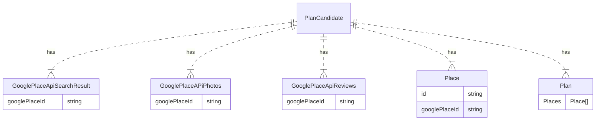

# Firestore Schema

## PlanCandidate

PlanCandidateはプランとプランに含まれる場所の情報を持っている  

### Google Places APIで取得したデータ
`Google Places API`から取得された場所のデータは`GooglePlaceApiSearchResult`、`GooglePlaceAPiPhotos`、`GooglePlaceApiReviews`に保存される。  
`PlanCandidateId`がわかっていれば、すべてのデータが取得できるようにすると最も取得効率が良いため、写真やレビューのサブコレクションを`PlanCandidate`の直下においている  
（写真やレビューのサブコレクションを`GooglePlacesApiSearchResult`のそれぞれのドキュメントの中に作成すると、2段階で取得する必要がある）